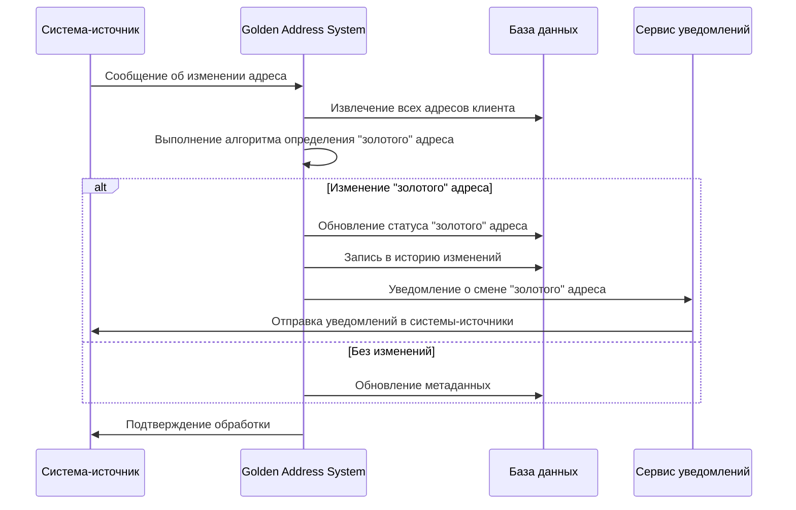

# Алгоритм определения "золотого" адреса

## 1. Введение

Данный документ детально описывает алгоритм определения "золотого" адреса в системе Golden Address. Алгоритм разработан для решения проблемы выбора наиболее достоверного адреса клиента из нескольких версий, хранящихся в различных системах компании.

## 2. Цели и функции алгоритма

### 2.1. Основные цели алгоритма:

- Определить наиболее достоверный и актуальный адрес клиента
- Минимизировать вероятность возврата писем
- Обеспечить своевременное обновление "золотого" адреса при поступлении новой информации
- Автоматизировать процесс выбора адреса для отправки официальных писем

### 2.2. Ключевые функции:

- Сбор и обработка адресных данных из различных источников
- Нормализация и стандартизация адресов
- Оценка достоверности каждого адреса по набору критериев
- Выбор адреса с наивысшим рейтингом достоверности
- Обновление "золотого" адреса при поступлении новой информации

## 3. Общий процесс работы алгоритма

```mermaid
flowchart TD
    A[Сбор адресов из всех систем] --> B[Предварительная обработка данных]
    B --> C[Нормализация и стандартизация]
    C --> D[Верификация и обогащение данных]
    D --> E[Расчет рейтинга достоверности]
    E --> F[Определение "золотого" адреса]
    F --> G[Публикация "золотого" адреса]
    G --> H[Синхронизация с системами-источниками]
    G --> I[Запись в историю изменений]

    J[Новое обновление адреса] -.-> A
```

## 4. Этапы обработки адресов

### 4.1. Сбор адресов из систем-источников

#### Входные данные:

- Идентификатор клиента
- Данные о клиенте из систем-источников (биллинговая система, система доставки, маркетинговая система, система поддержки)

#### Процесс:

1. Извлечение всех доступных адресов клиента из систем-источников
2. Сохранение метаданных об источнике и времени получения
3. Создание унифицированной структуры для хранения адресов
4. Исключение дубликатов на основе точного совпадения

#### Выходные данные:

- Список уникальных адресов с метаданными о происхождении

### 4.2. Предварительная обработка данных

#### Процесс:

1. Очистка адресов от очевидных ошибок и опечаток
2. Разбиение адреса на компоненты (страна, регион, город, улица, дом, квартира и т.д.)
3. Выявление недостающих компонентов
4. Удаление спецсимволов и лишних пробелов
5. Приведение к единому регистру

#### Пример кода (псевдокод):

```python
def preprocess_address(address):
    # Очистка от спецсимволов и лишних пробелов
    address = remove_special_chars(address)
    address = normalize_spaces(address)

    # Разбиение на компоненты
    components = split_to_components(address)

    # Приведение к нижнему регистру
    for key in components:
        components[key] = components[key].lower()

    # Проверка полноты
    completeness = check_completeness(components)

    return {
        'components': components,
        'completeness': completeness,
        'original': address
    }
```

### 4.3. Нормализация и стандартизация

#### Процесс:

1. Приведение компонентов адреса к стандартному виду
2. Исправление сокращений и аббревиатур
3. Стандартизация названий улиц, городов, регионов
4. Проверка соответствия официальным справочникам (ФИАС, КЛАДР)
5. Структурирование адреса по стандартной модели

#### Пример кода (псевдокод):

```python
def normalize_address(address_data):
    components = address_data['components']

    # Стандартизация сокращений
    components['street'] = standardize_street_name(components['street'])
    components['city'] = standardize_city_name(components['city'])
    components['region'] = standardize_region_name(components['region'])

    # Проверка по справочникам
    fias_data = check_in_fias(components)
    if fias_data:
        components = update_with_fias_data(components, fias_data)

    # Создание стандартизированного представления
    standardized = create_standardized_representation(components)

    return {
        'components': components,
        'standardized': standardized,
        'fias_verified': bool(fias_data),
        'original': address_data['original']
    }
```

### 4.4. Верификация и обогащение данных

#### Процесс:

1. Проверка существования адреса через геокодирование
2. Обогащение данных географическими координатами
3. Проверка через базы почтовых индексов
4. Проверка истории доставок
5. Анализ истории успешных коммуникаций

#### Пример кода (псевдокод):

```python
def verify_and_enrich_address(address_data):
    # Геокодирование
    geo_data = geocode_address(address_data['standardized'])

    # Проверка почтового индекса
    postal_data = verify_postal_code(address_data['components'].get('postal_code'))

    # Проверка истории доставок
    delivery_history = check_delivery_history(address_data['standardized'])

    # Анализ коммуникаций
    communication_history = check_communication_history(address_data['standardized'])

    return {
        **address_data,
        'geo_verified': bool(geo_data),
        'geo_data': geo_data,
        'postal_verified': bool(postal_data),
        'delivery_success_rate': delivery_history.get('success_rate', 0),
        'last_successful_delivery': delivery_history.get('last_success_date'),
        'communication_success_rate': communication_history.get('success_rate', 0)
    }
```

## 5. Алгоритм расчета рейтинга достоверности

### 5.1. Факторы рейтинга и их веса

| Фактор                | Вес | Описание                                                                                |
| --------------------- | --- | --------------------------------------------------------------------------------------- |
| Актуальность          | 30% | Оценка актуальности адреса на основе времени последнего обновления и частоты обновлений |
| Источник              | 20% | Оценка надежности системы-источника                                                     |
| Полнота               | 15% | Оценка полноты адреса и наличия всех необходимых компонентов                            |
| Верификация           | 15% | Оценка подтверждения адреса через внешние сервисы                                       |
| Частота использования | 10% | Оценка частоты использования адреса для доставки и коммуникаций                         |
| Консистентность       | 10% | Оценка совпадения адреса в разных системах и стабильности во времени                    |

### 5.2. Расчет рейтинга по каждому фактору

#### 5.2.1. Актуальность (0-30 баллов)

```python
def calculate_recency_score(address_data, all_addresses):
    # Время последнего обновления (0-20 баллов)
    last_update = address_data['metadata']['last_update_date']
    days_since_update = (current_date - last_update).days

    if days_since_update <= 30:
        time_score = 20
    elif days_since_update <= 90:
        time_score = 15
    elif days_since_update <= 180:
        time_score = 10
    elif days_since_update <= 365:
        time_score = 5
    else:
        time_score = 0

    # Частота обновлений (0-10 баллов)
    update_history = get_update_history(address_data['id'])
    update_frequency = calculate_update_frequency(update_history)

    if update_frequency == 'high':
        frequency_score = 10
    elif update_frequency == 'medium':
        frequency_score = 7
    elif update_frequency == 'low':
        frequency_score = 3
    else:
        frequency_score = 0

    return time_score + frequency_score
```

#### 5.2.2. Источник (0-20 баллов)

```python
def calculate_source_score(address_data):
    source = address_data['metadata']['source']

    # Приоритет источников
    if source == 'delivery_system':
        source_priority_score = 20  # Высший приоритет
    elif source == 'billing_system':
        source_priority_score = 15
    elif source == 'support_system':
        source_priority_score = 10
    elif source == 'marketing_system':
        source_priority_score = 5
    else:
        source_priority_score = 0

    return source_priority_score
```

#### 5.2.3. Полнота (0-15 баллов)

```python
def calculate_completeness_score(address_data):
    components = address_data['components']
    required_fields = ['country', 'region', 'city', 'street', 'house']
    optional_fields = ['building', 'apartment', 'entrance', 'floor', 'postal_code']

    # Проверка обязательных полей (0-10 баллов)
    required_score = 0
    for field in required_fields:
        if components.get(field):
            required_score += 2

    # Проверка дополнительных полей (0-5 баллов)
    optional_score = 0
    for field in optional_fields:
        if components.get(field):
            optional_score += 1
    optional_score = min(optional_score, 5)

    return required_score + optional_score
```

#### 5.2.4. Верификация (0-15 баллов)

```python
def calculate_verification_score(address_data):
    score = 0

    # Проверка через ФИАС/КЛАДР (0-5 баллов)
    if address_data['fias_verified']:
        score += 5

    # Геокодирование (0-5 баллов)
    if address_data['geo_verified']:
        score += 5

    # История доставок (0-5 баллов)
    delivery_success_rate = address_data['delivery_success_rate']
    if delivery_success_rate >= 0.9:
        score += 5
    elif delivery_success_rate >= 0.7:
        score += 3
    elif delivery_success_rate >= 0.5:
        score += 1

    return score
```

#### 5.2.5. Частота использования (0-10 баллов)

```python
def calculate_usage_score(address_data):
    # Использование для доставки (0-5 баллов)
    delivery_count = address_data['metadata'].get('delivery_count', 0)
    if delivery_count >= 10:
        delivery_score = 5
    elif delivery_count >= 5:
        delivery_score = 3
    elif delivery_count >= 1:
        delivery_score = 1
    else:
        delivery_score = 0

    # Использование для коммуникаций (0-5 баллов)
    communication_count = address_data['metadata'].get('communication_count', 0)
    if communication_count >= 20:
        communication_score = 5
    elif communication_count >= 10:
        communication_score = 3
    elif communication_count >= 3:
        communication_score = 1
    else:
        communication_score = 0

    return delivery_score + communication_score
```

#### 5.2.6. Консистентность (0-10 баллов)

```python
def calculate_consistency_score(address_data, all_addresses):
    # Совпадение в разных системах (0-5 баллов)
    systems_with_same_address = count_systems_with_same_address(address_data, all_addresses)
    if systems_with_same_address >= 3:
        systems_score = 5
    elif systems_with_same_address == 2:
        systems_score = 3
    elif systems_with_same_address == 1:
        systems_score = 0

    # Стабильность во времени (0-5 баллов)
    stability = calculate_address_stability(address_data['id'])
    if stability == 'high':
        stability_score = 5
    elif stability == 'medium':
        stability_score = 3
    else:
        stability_score = 0

    return systems_score + stability_score
```

### 5.3. Суммарный рейтинг достоверности

```python
def calculate_total_credibility_score(address_data, all_addresses):
    recency_score = calculate_recency_score(address_data, all_addresses)
    source_score = calculate_source_score(address_data)
    completeness_score = calculate_completeness_score(address_data)
    verification_score = calculate_verification_score(address_data)
    usage_score = calculate_usage_score(address_data)
    consistency_score = calculate_consistency_score(address_data, all_addresses)

    total_score = recency_score + source_score + completeness_score + verification_score + usage_score + consistency_score

    return {
        'total_score': total_score,
        'recency_score': recency_score,
        'source_score': source_score,
        'completeness_score': completeness_score,
        'verification_score': verification_score,
        'usage_score': usage_score,
        'consistency_score': consistency_score
    }
```

## 6. Определение "золотого" адреса

### 6.1. Общий алгоритм выбора "золотого" адреса

```python
def determine_golden_address(client_id):
    # Сбор адресов
    addresses = collect_addresses(client_id)

    # Если адрес только один, он становится "золотым"
    if len(addresses) == 1:
        return mark_as_golden(addresses[0])

    # Предварительная обработка
    processed_addresses = [preprocess_address(addr) for addr in addresses]

    # Нормализация и стандартизация
    normalized_addresses = [normalize_address(addr) for addr in processed_addresses]

    # Верификация и обогащение
    verified_addresses = [verify_and_enrich_address(addr) for addr in normalized_addresses]

    # Расчет рейтинга достоверности для каждого адреса
    scored_addresses = []
    for addr in verified_addresses:
        score_data = calculate_total_credibility_score(addr, verified_addresses)
        scored_addresses.append({**addr, **score_data})

    # Сортировка по убыванию общего рейтинга
    sorted_addresses = sorted(scored_addresses, key=lambda x: x['total_score'], reverse=True)

    # Выбор адреса с наивысшим рейтингом
    golden_address = sorted_addresses[0]

    # В случае равенства рейтингов
    if len(sorted_addresses) > 1 and sorted_addresses[0]['total_score'] == sorted_addresses[1]['total_score']:
        golden_address = resolve_tie(sorted_addresses[0], sorted_addresses[1])

    return mark_as_golden(golden_address)
```

### 6.2. Разрешение конфликтов при равных рейтингах

В случае, если два или более адреса имеют одинаковый рейтинг достоверности, применяются дополнительные правила для разрешения конфликта:

```python
def resolve_tie(address1, address2):
    # 1. Приоритет более полного адреса
    if address1['completeness_score'] != address2['completeness_score']:
        return address1 if address1['completeness_score'] > address2['completeness_score'] else address2

    # 2. Приоритет более свежего адреса
    if address1['recency_score'] != address2['recency_score']:
        return address1 if address1['recency_score'] > address2['recency_score'] else address2

    # 3. Приоритет адреса из системы с более высоким приоритетом
    if address1['source_score'] != address2['source_score']:
        return address1 if address1['source_score'] > address2['source_score'] else address2

    # 4. Приоритет адреса с успешной историей доставки
    if address1['delivery_success_rate'] != address2['delivery_success_rate']:
        return address1 if address1['delivery_success_rate'] > address2['delivery_success_rate'] else address2

    # 5. В случае полного равенства - направление на ручную обработку
    return create_manual_resolution_task(address1, address2)
```

### 6.3. Обработка исключительных ситуаций

Для обработки исключительных ситуаций предусмотрены следующие механизмы:

1. **Ручная обработка**

   - Создание задачи для оператора при невозможности автоматического разрешения
   - Интерфейс для просмотра и выбора адреса оператором
   - Возможность добавления комментария и пометки "проверено вручную"

2. **Обработка противоречивых данных**

   - Выявление сильно противоречащих друг другу адресов
   - Пороговые значения для различия компонентов адреса
   - Алгоритм обнаружения аномалий в адресных данных

3. **Временная блокировка обновлений**
   - Механизм предотвращения частых обновлений "золотого" адреса
   - Минимальный период между изменениями статуса
   - Правила для исключений (например, подтвержденные изменения)

## 7. Обновление "золотого" адреса

### 7.1. Триггеры для пересчета "золотого" адреса

Пересчет "золотого" адреса происходит в следующих случаях:

1. **Изменение адреса в системе-источнике**

   - Автоматическое уведомление через API интеграции
   - Плановая синхронизация (ежедневная)

2. **Успешная/неуспешная доставка**

   - Обратная связь от системы доставки
   - Изменение показателей успешности доставки

3. **Ручное указание клиентом**

   - Обновление через службу поддержки
   - Самостоятельное обновление через личный кабинет

4. **Периодическая проверка и обновление**
   - Плановый пересчет (еженедельно)
   - Валидация устаревших данных (ежемесячно)

### 7.2. Процесс обновления



### 7.3. Синхронизация с системами-источниками

Процесс синхронизации "золотого" адреса с системами-источниками может происходить по одной из следующих моделей:

1. **Активная синхронизация (Push-модель)**

   - Golden Address System инициирует обновление во всех системах-источниках
   - Обеспечивает максимальную согласованность данных
   - Требует наличия API для записи в каждой системе-источнике

2. **Пассивная синхронизация (Pull-модель)**

   - Системы-источники запрашивают "золотой" адрес при необходимости
   - Снижает связанность между системами
   - Может приводить к временным расхождениям

3. **Гибридная модель**
   - Для критичных систем используется активная синхронизация
   - Для остальных - пассивная
   - Оптимальный баланс между согласованностью и связанностью

## 8. Оценка эффективности алгоритма

### 8.1. Метрики оценки качества

Для оценки эффективности работы алгоритма используются следующие метрики:

1. **Точность определения адреса**

   - % правильно определенных "золотых" адресов
   - Измеряется на тестовой выборке с известным правильным ответом

2. **Уровень автоматизации**

   - % адресов, где "золотой" адрес определен автоматически
   - % адресов, требующих ручной обработки

3. **Стабильность решений**

   - Частота изменения "золотого" адреса
   - Количество откатов предыдущих решений

4. **Прикладная эффективность**
   - % успешно доставленных писем
   - Снижение возвратов и повторных отправок

### 8.2. Анализ ошибок и процесс улучшения алгоритма

Для постоянного улучшения алгоритма используется следующий процесс:

1. **Сбор данных о ошибках**

   - Регистрация случаев неверного определения "золотого" адреса
   - Анализ причин возвратов писем

2. **Классификация ошибок**

   - Ошибки в источниках данных
   - Ошибки алгоритма нормализации
   - Ошибки в расчете рейтинга
   - Ошибки при разрешении конфликтов

3. **Корректировка алгоритма**

   - Настройка весов факторов
   - Улучшение алгоритмов нормализации и верификации
   - Добавление новых правил разрешения конфликтов

4. **A/B тестирование изменений**
   - Проверка улучшений на тестовой выборке
   - Сравнение эффективности разных версий алгоритма

## 9. Заключение

Представленный алгоритм определения "золотого" адреса обеспечивает надежное и автоматизированное решение проблемы выбора наиболее достоверного адреса клиента из нескольких вариантов.

Ключевыми преимуществами алгоритма являются:

- Многофакторная оценка достоверности адресов
- Гибкая настройка весов и правил
- Автоматическое обновление при поступлении новой информации
- Механизмы разрешения конфликтов
- Обработка исключительных ситуаций

Алгоритм спроектирован для непрерывного совершенствования на основе обратной связи и анализа метрик эффективности.

## Приложение: Псевдокод полного алгоритма

```python
def golden_address_algorithm(client_id):
    # 1. Сбор адресов из всех систем
    addresses = collect_addresses_from_all_systems(client_id)

    # Если адрес только один
    if len(addresses) == 1:
        return mark_as_golden(addresses[0])

    processed_addresses = []

    # 2. Обработка каждого адреса
    for address in addresses:
        # Предварительная обработка
        processed = preprocess_address(address)

        # Нормализация и стандартизация
        normalized = normalize_address(processed)

        # Верификация и обогащение
        verified = verify_and_enrich_address(normalized)

        processed_addresses.append(verified)

    # 3. Расчет рейтинга достоверности
    scored_addresses = []
    for address in processed_addresses:
        # Расчет компонентов рейтинга
        recency_score = calculate_recency_score(address, processed_addresses)
        source_score = calculate_source_score(address)
        completeness_score = calculate_completeness_score(address)
        verification_score = calculate_verification_score(address)
        usage_score = calculate_usage_score(address)
        consistency_score = calculate_consistency_score(address, processed_addresses)

        # Суммарный рейтинг
        total_score = recency_score + source_score + completeness_score + verification_score + usage_score + consistency_score

        scored_addresses.append({
            **address,
            'total_score': total_score,
            'score_components': {
                'recency': recency_score,
                'source': source_score,
                'completeness': completeness_score,
                'verification': verification_score,
                'usage': usage_score,
                'consistency': consistency_score
            }
        })

    # 4. Сортировка по убыванию рейтинга
    sorted_addresses = sorted(scored_addresses, key=lambda x: x['total_score'], reverse=True)

    # 5. Определение "золотого" адреса
    if len(sorted_addresses) > 1 and sorted_addresses[0]['total_score'] == sorted_addresses[1]['total_score']:
        # Разрешение конфликта при равных рейтингах
        golden_address = resolve_tie(sorted_addresses[0], sorted_addresses[1])
    else:
        golden_address = sorted_addresses[0]

    # 6. Сохранение результата
    save_golden_address(client_id, golden_address)

    # 7. Синхронизация с системами-источниками
    if is_new_golden_address(client_id, golden_address):
        notify_source_systems(client_id, golden_address)
        log_golden_address_change(client_id, golden_address)

    return golden_address
```
