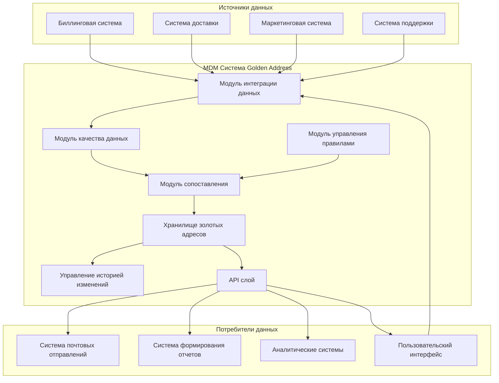
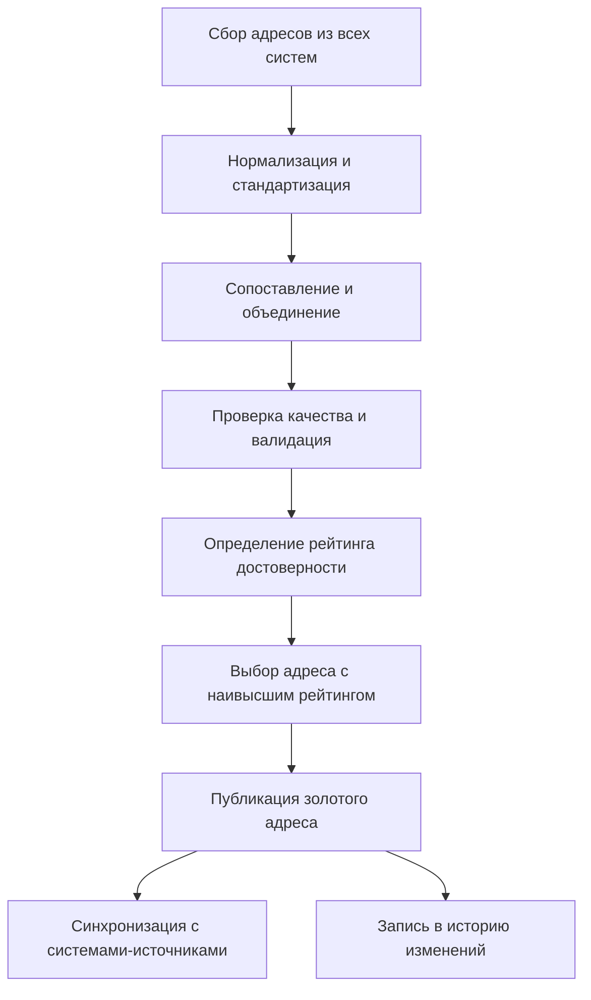
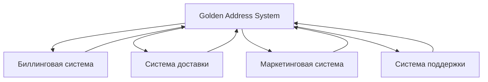
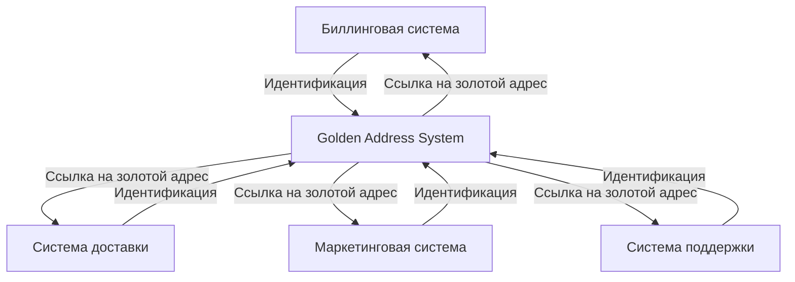
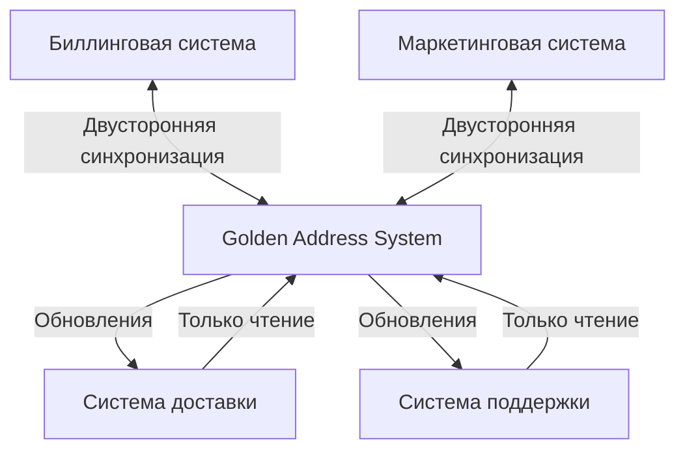
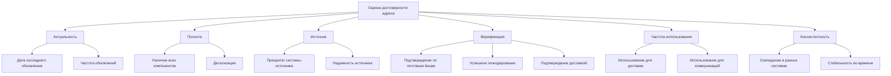
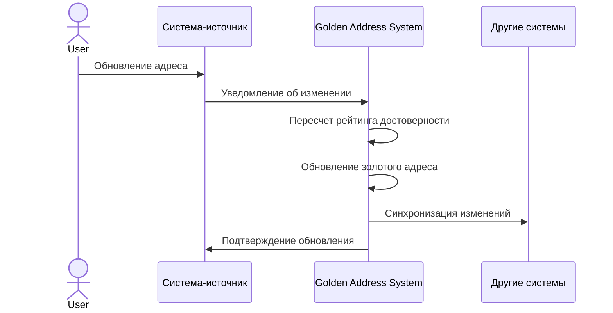
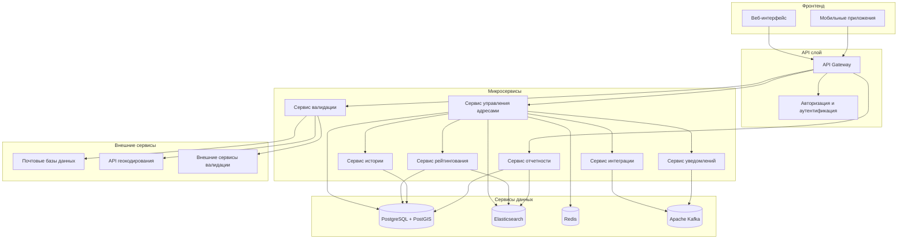
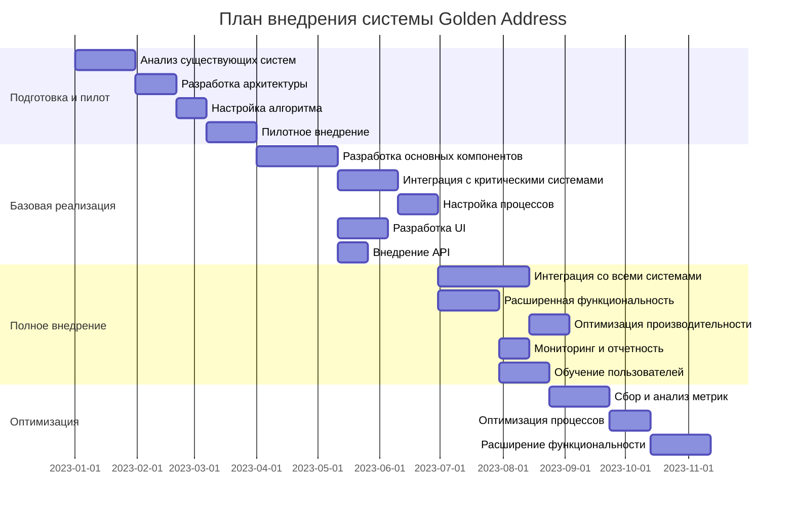

# Архитектурные диаграммы системы Golden Address

## Общая архитектура решения

## Процесс определения "золотого" адреса

## Модели интеграции

### 1. Централизованная (Hub-and-Spoke)

### 2. Реестровая (Registry)

### 3. Гибридная модель

## Алгоритм оценки достоверности адреса

## Процесс обновления "золотого" адреса

## Техническая архитектура компонентов

## Этапы внедрения и развертывания

