# Система управления очередями Kaspi Queue Management System (KQMS)

## Содержание

1. [Введение](#введение)
2. [Проблематика](#проблематика)
3. [Предлагаемое решение](#предлагаемое-решение)
4. [Архитектура системы](#архитектура-системы)
5. [Используемые архитектурные паттерны](#используемые-архитектурные-паттерны)
6. [Компоненты системы](#компоненты-системы)
7. [Пользовательские сценарии](#пользовательские-сценарии)
8. [Масштабирование и производительность](#масштабирование-и-производительность)
9. [Технологии и инструменты](#технологии-и-инструменты)
10. [Внедрение и развитие](#внедрение-и-развитие)

## Введение

Kaspi Queue Management System (KQMS) — это современная система управления очередями, разработанная для оптимизации обслуживания клиентов в отделениях Kaspi Bank. Система призвана решить проблему длинных очередей и повысить общую пропускную способность банковских отделений за счет эффективного распределения ресурсов и оптимизации процесса обслуживания.

## Проблематика

В настоящее время отделения Kaspi Bank сталкиваются со следующими проблемами:

- **Длинные очереди клиентов**, ожидающих различные услуги (кредиты, переводы, выпуск карт, снятие наличных, обмен валюты и др.)
- **Один оператор/одна очередь** для всех типов операций, что создает неэффективное распределение ресурсов
- **Разное время обслуживания** для различных операций
- **Отсутствие приоритизации** клиентов и операций
- **Невозможность предварительного планирования** посещения банка клиентами
- **Ограниченная прозрачность** в отношении ожидаемого времени обслуживания

Эти проблемы приводят к низкой удовлетворенности клиентов, неэффективному использованию ресурсов отделения и снижению общей пропускной способности.

## Предлагаемое решение

KQMS предлагает комплексное решение для управления очередями, которое включает:

1. **Сегментация очередей по типам услуг** с выделением специализированных операторов для каждого типа
2. **Интеллектуальная система маршрутизации клиентов** к наиболее подходящим операторам
3. **Многоканальная система регистрации в очереди** (мобильное приложение, киоски самообслуживания, веб-интерфейс)
4. **Прогнозирование потока клиентов** и динамическое распределение ресурсов
5. **Система приоритизации** с учетом типа клиента и операции
6. **Предварительная запись на обслуживание** с выбором удобного времени
7. **Информирование клиентов** о текущем состоянии очереди и ожидаемом времени обслуживания
8. **Аналитика и отчетность** для оптимизации работы отделения

## Архитектура системы

KQMS реализуется на основе современной микросервисной архитектуры, которая обеспечивает гибкость, масштабируемость и высокую доступность.

```mermaid
flowchart TB
    subgraph "Клиентский уровень"
        MobileApp["Мобильное приложение"]
        WebPortal["Веб-портал"]
        Kiosk["Киоски в отделениях"]
        OperatorUI["Интерфейс оператора"]
        AdminUI["Административный интерфейс"]
    end

    subgraph "API Gateway"
        Gateway["API Gateway"]
        Gateway --- Auth["Аутентификация"]
        Gateway --- Routing["Маршрутизация"]
        Gateway --- RateLimit["Ограничение запросов"]
        Gateway --- Logging["Логирование"]
    end

    subgraph "Микросервисы"
        RegistrationService["Сервис регистрации клиентов"]
        QueueService["Сервис управления очередями"]
        RoutingService["Сервис маршрутизации"]
        NotificationService["Сервис уведомлений"]
        SchedulingService["Сервис планирования"]
        AnalyticsService["Сервис аналитики"]
        OperatorService["Сервис управления операторами"]
        CustomerService["Сервис данных клиентов"]
    end

    subgraph "Слой интеграции"
        KaspiCore["Интеграция с ядром Kaspi"]
        CRMIntegration["Интеграция с CRM"]
        BranchManagement["Управление отделениями"]
    end

    subgraph "Слой данных"
        PostgreSQL["PostgreSQL"]
        Redis["Redis"]
        Elasticsearch["Elasticsearch"]
        TimescaleDB["TimescaleDB для временных рядов"]
    end

    subgraph "Инфраструктурные сервисы"
        Kafka["Kafka Event Bus"]
        Monitoring["Мониторинг и алертинг"]
        Logging2["Централизованное логирование"]
        ConfigServer["Сервер конфигураций"]
    end

    MobileApp --> Gateway
    WebPortal --> Gateway
    Kiosk --> Gateway
    OperatorUI --> Gateway
    AdminUI --> Gateway

    Gateway --> RegistrationService
    Gateway --> QueueService
    Gateway --> NotificationService
    Gateway --> SchedulingService
    Gateway --> AnalyticsService
    Gateway --> OperatorService
    Gateway --> CustomerService

    RegistrationService --> Kafka
    QueueService --> Kafka
    RoutingService --> Kafka
    NotificationService --> Kafka

    QueueService --> PostgreSQL
    RoutingService --> Redis
    AnalyticsService --> Elasticsearch
    AnalyticsService --> TimescaleDB

    RegistrationService --> KaspiCore
    CustomerService --> CRMIntegration
    OperatorService --> BranchManagement
```

## Используемые архитектурные паттерны

В архитектуре KQMS применяются следующие архитектурные паттерны:

1. **Микросервисная архитектура** — система разделена на небольшие, независимые сервисы, каждый из которых отвечает за определенную бизнес-функцию. Это обеспечивает гибкость разработки, масштабирования и развертывания.

2. **API Gateway** — централизованная точка входа для всех клиентских запросов, обеспечивающая маршрутизацию, аутентификацию, авторизацию и мониторинг.

3. **Event-Driven Architecture (EDA)** — асинхронная коммуникация между сервисами посредством событий, обеспечивающая слабую связность и повышенную устойчивость системы.

4. **Command Query Responsibility Segregation (CQRS)** — разделение операций чтения и записи для оптимизации производительности и масштабируемости.

5. **Circuit Breaker** — защита от каскадных сбоев при взаимодействии между сервисами.

6. **Saga Pattern** — координация распределенных транзакций между микросервисами для обеспечения согласованности данных.

7. **Cache-Aside Pattern** — кеширование часто используемых данных для повышения производительности.

8. **Bulkhead Pattern** — изоляция компонентов системы для предотвращения распространения сбоев.

9. **Database-per-Service** — каждый микросервис имеет собственное хранилище данных для обеспечения независимости и масштабируемости.

10. **Reactive Systems Pattern** — обеспечение отзывчивости, устойчивости и эластичности системы.

## Компоненты системы

### 1. Сервис регистрации клиентов

Отвечает за процесс регистрации клиентов в очереди через различные каналы:

- Мобильное приложение Kaspi.kz
- Веб-портал
- Киоски самообслуживания в отделениях
- Регистрация через оператора

Функциональность:

- Идентификация клиента (по ID, номеру телефона, карте)
- Выбор типа операции
- Регистрация в очереди
- Выдача номера очереди и расчетного времени ожидания
- Интеграция с существующими системами идентификации Kaspi

### 2. Сервис управления очередями

Центральный компонент системы, отвечающий за:

- Управление очередями для различных типов услуг
- Обработку статусов и статистики обслуживания
- Приоритизацию клиентов согласно бизнес-правилам
- Отслеживание времени ожидания и обслуживания
- Оптимизацию распределения клиентов между операторами

### 3. Сервис маршрутизации

Определяет оптимального оператора для каждого клиента на основе:

- Типа операции
- Квалификации операторов
- Текущей нагрузки
- Приоритета клиента
- Прогнозируемой длительности обслуживания
- Исторических данных о производительности операторов

### 4. Сервис уведомлений

Обеспечивает коммуникацию с клиентами:

- Push-уведомления в мобильном приложении
- SMS-оповещения
- Email-уведомления
- Отображение информации на экранах в отделении
- Уведомления о приближении очереди клиента
- Напоминания о запланированных визитах

### 5. Сервис планирования

Позволяет клиентам планировать посещение отделения:

- Выбор удобного времени и даты
- Расчет оптимальных слотов на основе прогнозируемой загрузки
- Управление графиком работы операторов
- Обработка отмен и переносов
- Предварительный сбор информации о цели визита

### 6. Сервис аналитики

Обеспечивает сбор и анализ данных о работе системы:

- Анализ потока клиентов по времени, дням недели, сезонам
- Производительность операторов
- Время ожидания и обслуживания
- Прогнозирование нагрузки
- Выявление узких мест в процессе обслуживания
- Формирование рекомендаций по оптимизации

### 7. Сервис управления операторами

Управляет работой операторов в отделении:

- Отслеживание статусов операторов (активен, на перерыве, не работает)
- Распределение операторов по типам услуг
- Управление рабочими сменами
- Мониторинг производительности
- Обучение и развитие навыков

### 8. Сервис данных клиентов

Интегрируется с CRM-системой Kaspi для:

- Получения информации о клиенте
- Определения сегмента и приоритета клиента
- Доступа к истории взаимодействия с банком
- Подготовки операторов к обслуживанию конкретного клиента
- Персонализации обслуживания

## Пользовательские сценарии

### Предварительная запись через мобильное приложение

1. Клиент открывает мобильное приложение Kaspi.kz
2. Выбирает раздел "Отделения банка"
3. Выбирает ближайшее или предпочтительное отделение
4. Выбирает тип операции, которую необходимо выполнить
5. Система показывает доступные временные слоты
6. Клиент выбирает удобное время
7. Получает подтверждение с QR-кодом и номером записи
8. В назначенное время приходит в отделение и сканирует QR-код на киоске или показывает оператору
9. Система автоматически добавляет клиента в приоритетную очередь
10. Клиент получает уведомление о вызове к оператору

### Регистрация через киоск в отделении

1. Клиент приходит в отделение банка
2. Подходит к информационному киоску
3. Идентифицируется с помощью банковской карты или вводит номер телефона
4. Выбирает тип необходимой операции
5. Система оценивает текущую загрузку и приблизительное время ожидания
6. Клиент получает талон с номером очереди
7. Информационные экраны в отделении показывают текущее состояние очереди
8. Клиент получает уведомление (на телефон или через звуковое оповещение), когда подходит его очередь
9. Система направляет клиента к соответствующему оператору

### Управление очередью операторами

1. Оператор авторизуется в системе управления очередями
2. Видит список клиентов в своей очереди с указанием типа операции
3. Вызывает следующего клиента кнопкой "Следующий"
4. Система отправляет уведомление клиенту и отображает номер на информационном экране
5. Оператор отмечает начало обслуживания
6. После завершения операции оператор отмечает статус и результат обслуживания
7. Система автоматически вызывает следующего клиента или предлагает оператору сделать перерыв
8. В конце дня система генерирует отчет о производительности оператора

### Динамическое управление потоком клиентов

1. Система анализирует текущую загрузку отделения
2. При превышении определенного порога ожидания, активирует дополнительных операторов
3. Перераспределяет операторов между типами услуг в зависимости от длины очередей
4. При критической нагрузке, предлагает клиентам альтернативные варианты (другое отделение, другое время)
5. Администратор отделения получает уведомления о критических ситуациях и может вручную корректировать распределение ресурсов

## Масштабирование и производительность

### Подходы к масштабированию

1. **Горизонтальное масштабирование**

   - Независимое масштабирование каждого микросервиса в зависимости от нагрузки
   - Кластеризация всех компонентов для обеспечения высокой доступности
   - Использование контейнеризации (Docker) и оркестрации (Kubernetes)

2. **Распределенное кеширование**

   - Кеширование часто используемых данных в Redis
   - Распределенный кеш для сессий и временных данных
   - Снижение нагрузки на базы данных

3. **Асинхронная обработка**

   - Использование очередей сообщений (Kafka) для асинхронной обработки операций
   - Отложенная обработка некритичных операций
   - Балансировка пиковых нагрузок

4. **Сегментация данных**
   - Разделение данных по географическому принципу
   - Сегментация по отделениям банка
   - Архивация исторических данных

### Метрики производительности

Система отслеживает следующие ключевые метрики:

1. **Время ожидания клиентов**

   - Среднее время ожидания в очереди
   - Максимальное время ожидания
   - Время ожидания по типам операций

2. **Пропускная способность отделения**

   - Количество обслуженных клиентов в час/день
   - Пропускная способность по типам операций
   - Сравнение с историческими данными

3. **Эффективность операторов**

   - Среднее время обслуживания одного клиента
   - Количество обслуженных клиентов за смену
   - Соотношение успешных и проблемных операций

4. **Прогнозирование нагрузки**
   - Точность прогнозов потока клиентов
   - Эффективность распределения ресурсов
   - Выявление аномалий и пиковых нагрузок

### Стратегии оптимизации

1. **Балансировка нагрузки**

   - Динамическое перераспределение операторов между очередями
   - Приоритизация типов операций в зависимости от текущей загрузки
   - Перенаправление клиентов в менее загруженные отделения

2. **Предварительная подготовка**

   - Сбор информации о цели визита до начала обслуживания
   - Подготовка необходимых документов заранее
   - Предварительная проверка требований к операции

3. **Оптимизация интерфейсов**
   - Упрощение процесса регистрации в очереди
   - Интуитивно понятные интерфейсы для операторов
   - Визуализация состояния очередей для администраторов

## Технологии и инструменты

### Бэкенд

- **Java Spring Boot** для основных микросервисов
- **Node.js** для сервисов с высокой нагрузкой ввода-вывода
- **Kafka** для организации асинхронной коммуникации
- **PostgreSQL** для хранения основных данных
- **Redis** для кеширования и хранения временных данных
- **Elasticsearch** для полнотекстового поиска и аналитики
- **TimescaleDB** для хранения временных рядов и метрик

### Фронтенд

- **React** для веб-интерфейсов администраторов и операторов
- **React Native** для мобильного приложения
- **Material-UI** для унифицированного дизайна
- **Websockets** для обновления данных в реальном времени
- **D3.js** для визуализации данных и аналитики

### DevOps и инфраструктура

- **Docker** для контейнеризации
- **Kubernetes** для оркестрации контейнеров
- **Prometheus** и **Grafana** для мониторинга
- **ELK Stack** для централизованного логирования
- **Jenkins** для непрерывной интеграции и доставки
- **HashiCorp Vault** для управления секретами

### Инструменты интеграции

- **Apache Camel** для интеграций с внешними системами
- **Swagger/OpenAPI** для документирования API
- **gRPC** для высокопроизводительного взаимодействия между сервисами
- **GraphQL** для гибких API с клиентской стороны

## Внедрение и развитие

### Фазы внедрения

#### Фаза 1: Основа (2-3 месяца)

- Разработка ключевых компонентов системы управления очередями
- Внедрение базовой функциональности регистрации и управления очередями
- Интеграция с существующими системами Kaspi
- Пилотное внедрение в одном отделении банка

#### Фаза 2: Расширение функциональности (3-4 месяца)

- Добавление аналитических возможностей
- Реализация предварительной записи
- Внедрение системы уведомлений
- Расширение на несколько ключевых отделений
- Сбор и анализ обратной связи

#### Фаза 3: Масштабирование (4-6 месяцев)

- Оптимизация производительности на основе собранных данных
- Развертывание во всех отделениях Kaspi Bank
- Интеграция с мобильным приложением Kaspi.kz
- Реализация расширенной аналитики и прогнозирования

#### Фаза 4: Оптимизация и инновации (постоянно)

- Непрерывное улучшение на основе собранных метрик
- Внедрение алгоритмов машинного обучения для оптимизации
- Разработка новых функций на основе потребностей бизнеса
- Интеграция с новыми каналами взаимодействия с клиентами

### Ключевые факторы успеха

1. **Простота использования**

   - Интуитивно понятные интерфейсы для клиентов и персонала
   - Минимальные требования к обучению
   - Понятная обратная связь на каждом шаге

2. **Гибкость и адаптивность**

   - Возможность настройки под специфику каждого отделения
   - Адаптация к меняющимся бизнес-требованиям
   - Модульная архитектура для легкого расширения

3. **Интеграция с существующими системами**

   - Бесшовная интеграция с ИТ-ландшафтом Kaspi
   - Использование существующих данных о клиентах
   - Совместимость с существующими бизнес-процессами

4. **Измеримые результаты**
   - Четкие KPI для оценки успеха внедрения
   - Регулярные отчеты о повышении эффективности
   - Демонстрация ROI для руководства

### Дорожная карта развития

**Краткосрочные цели (6-12 месяцев)**

- Полное внедрение во всех отделениях Kaspi Bank
- Сокращение среднего времени ожидания на 40%
- Увеличение пропускной способности отделений на 30%
- Повышение удовлетворенности клиентов на 25%

**Среднесрочные цели (1-2 года)**

- Внедрение предиктивной аналитики для прогнозирования нагрузки
- Интеграция с системами умного отделения (Smart Branch)
- Оптимизация штатного расписания на основе данных о потоке клиентов
- Сокращение операционных расходов отделений на 15%

**Долгосрочные цели (2-3 года)**

- Создание единой омниканальной системы обслуживания клиентов
- Внедрение технологий компьютерного зрения для анализа поведения клиентов
- Персонализация обслуживания на основе истории и предпочтений клиента
- Трансформация отделений в центры финансового консультирования

## Заключение

Система управления очередями Kaspi Queue Management System (KQMS) представляет собой комплексное решение, направленное на повышение эффективности обслуживания клиентов в отделениях Kaspi Bank. Внедрение системы позволит значительно сократить время ожидания клиентов, оптимизировать работу персонала, повысить уровень удовлетворенности клиентов и увеличить общую пропускную способность отделений.

Использование современных архитектурных подходов и технологий обеспечивает гибкость, масштабируемость и высокую производительность системы, а модульная структура позволяет легко адаптировать ее под меняющиеся потребности бизнеса.

KQMS не просто решает проблему очередей, но и создает основу для цифровой трансформации банковских отделений, обеспечивая переход от традиционной модели обслуживания к современному, ориентированному на клиента подходу, где эффективность, удобство и персонализация становятся ключевыми факторами успеха.
