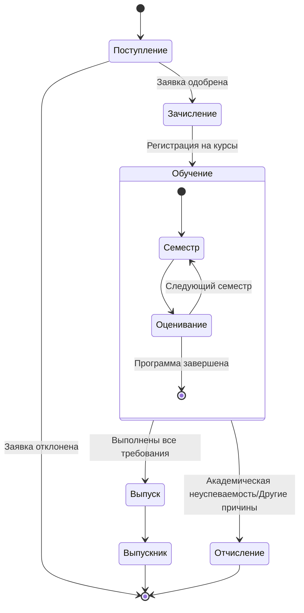
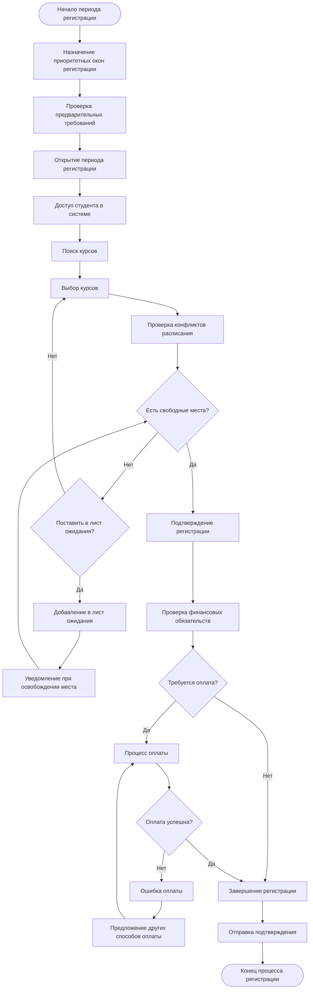
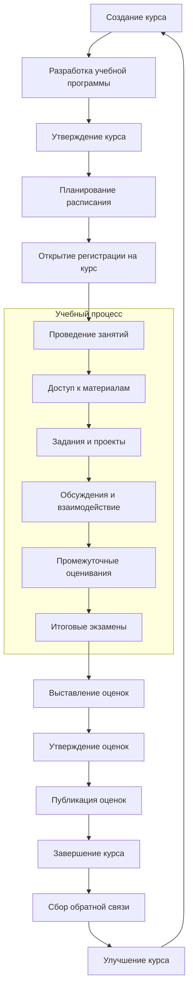
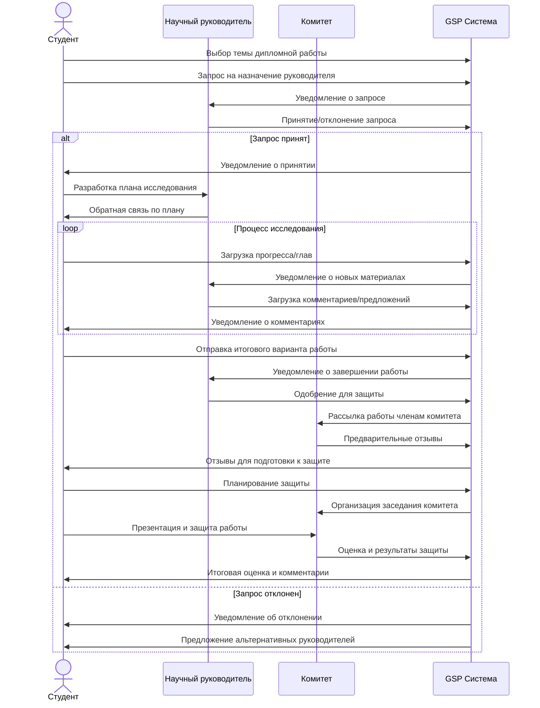
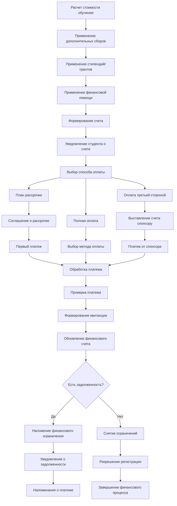
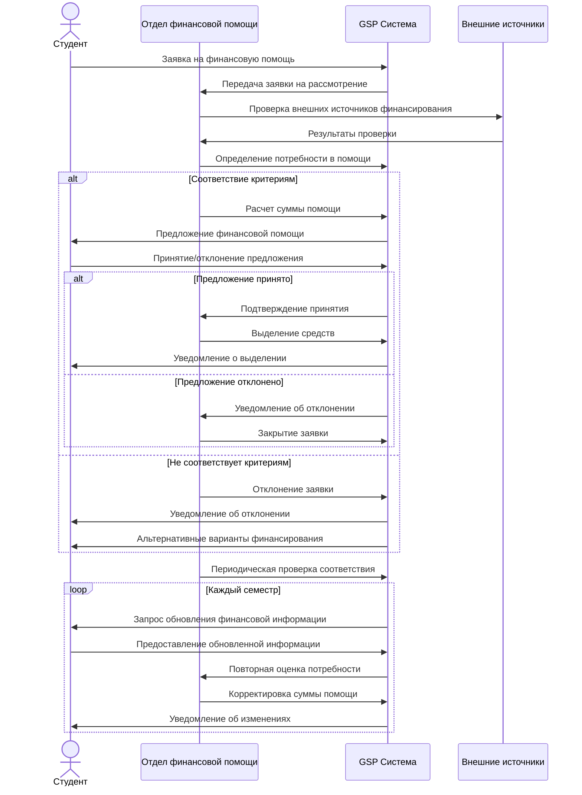
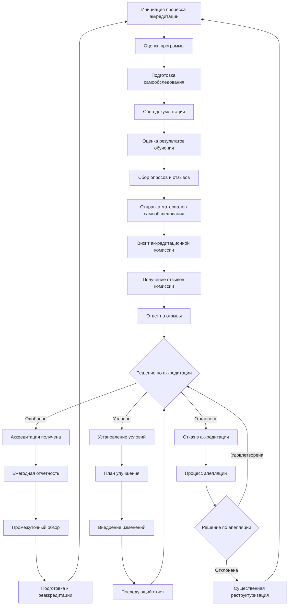
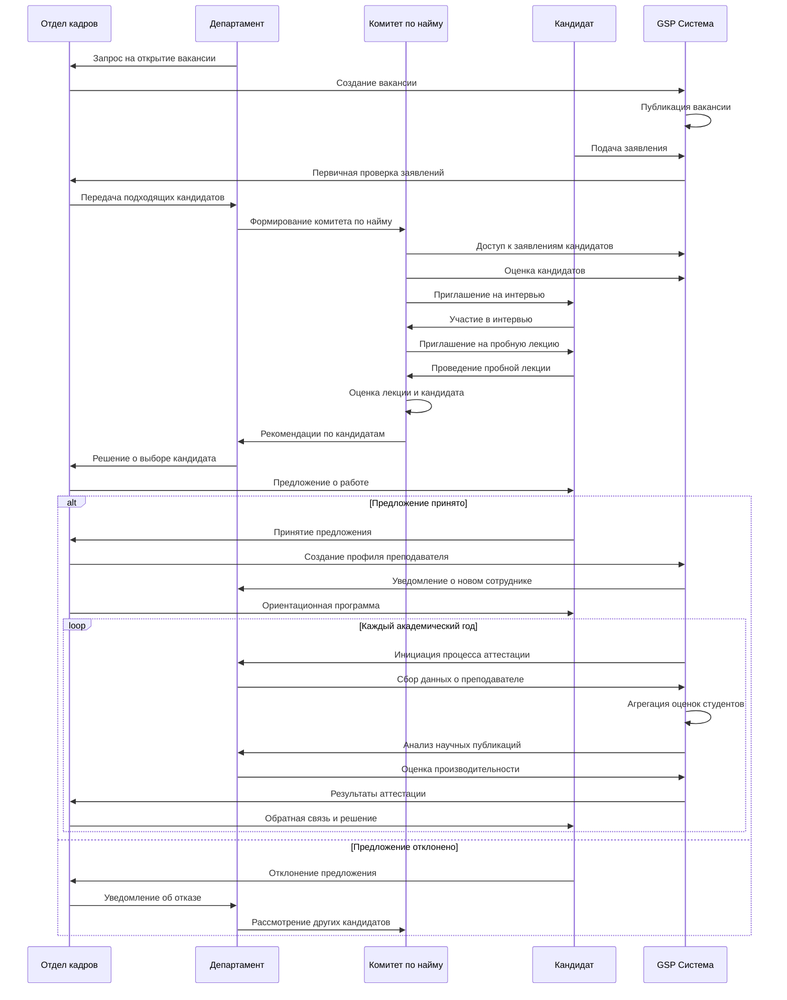
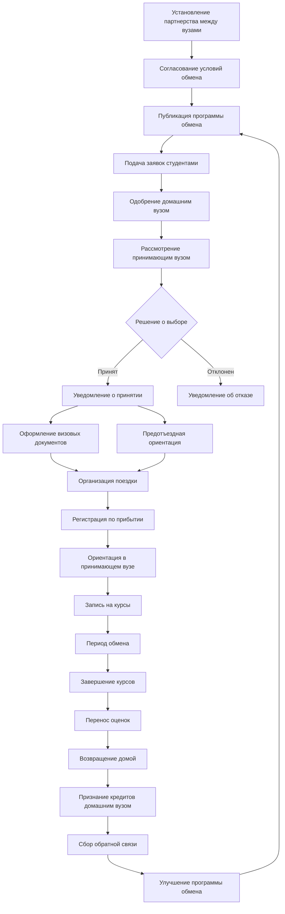
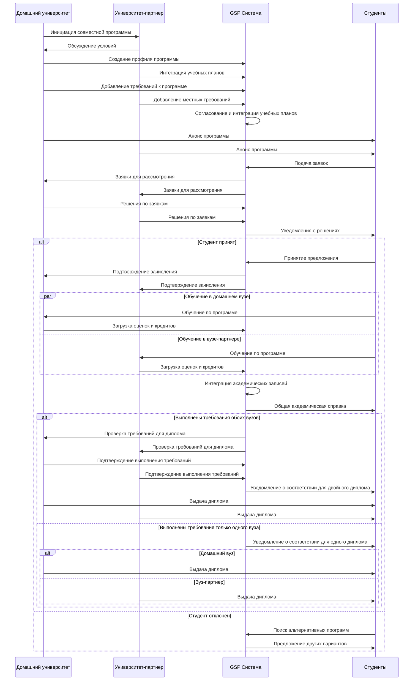

# Бизнес-процессы - Глобальный Студенческий Портал (GSP)

## Содержание

1. [Основные бизнес-потоки](#основные-бизнес-потоки)
2. [Академический жизненный цикл](#академический-жизненный-цикл)
3. [Финансовые процессы](#финансовые-процессы)
4. [Административные процессы](#административные-процессы)
5. [Международное взаимодействие](#международное-взаимодействие)

## Основные бизнес-потоки

### Жизненный цикл студента

### Процесс регистрации на курсы

## Академический жизненный цикл

### Процесс обучения и оценивания

### Процесс дипломной работы

## Финансовые процессы

### Процесс оплаты обучения

### Процесс выделения финансовой помощи

## Административные процессы

### Процесс аккредитации программы

### Процесс найма и аттестации преподавателей

## Международное взаимодействие

### Процесс обмена студентами

### Процесс международной образовательной программы

