# Технические диаграммы - Глобальный Студенческий Портал (GSP)

## Содержание

1. [Диаграмма безопасности](#диаграмма-безопасности)
2. [Диаграмма масштабирования](#диаграмма-масштабирования)
3. [Диаграмма интеграций](#диаграмма-интеграций)
4. [Диаграмма управления данными](#диаграмма-управления-данными)
5. [Диаграмма производительности](#диаграмма-производительности)

## Диаграмма безопасности

### Модель безопасности системы

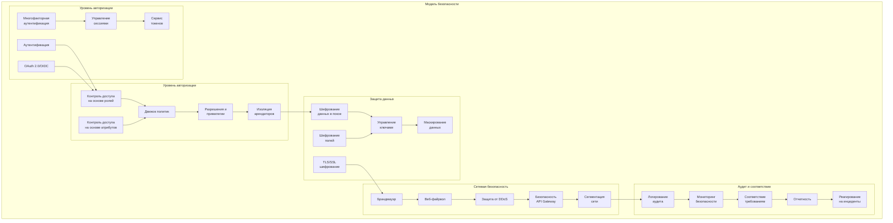

### Процесс обработки запроса с точки зрения безопасности

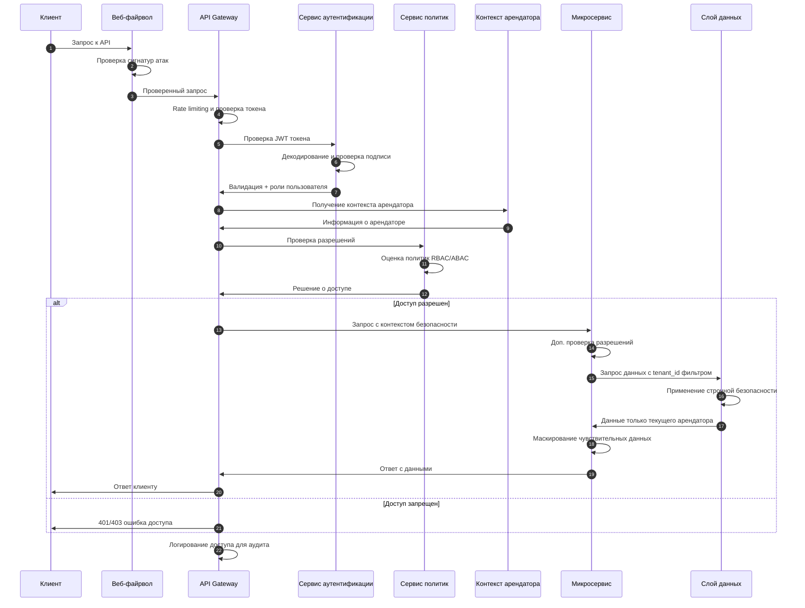

## Диаграмма масштабирования

### Стратегия масштабирования системы

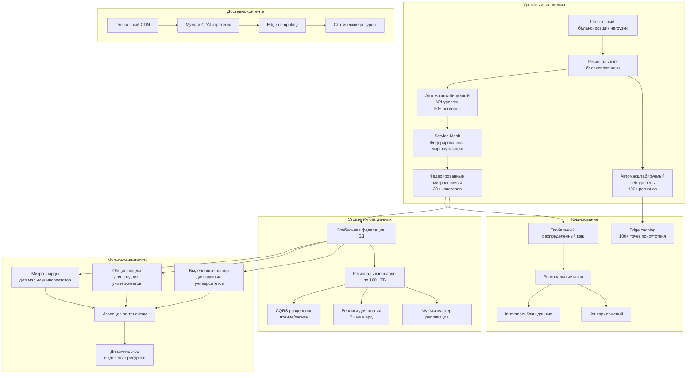

### Масштабирование нагрузки во время пиковых периодов

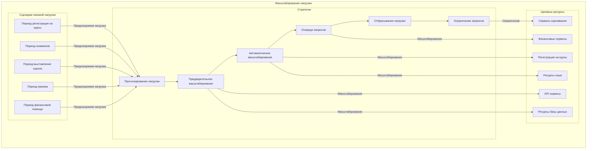

## Диаграмма интеграций

### Экосистема интеграций GSP

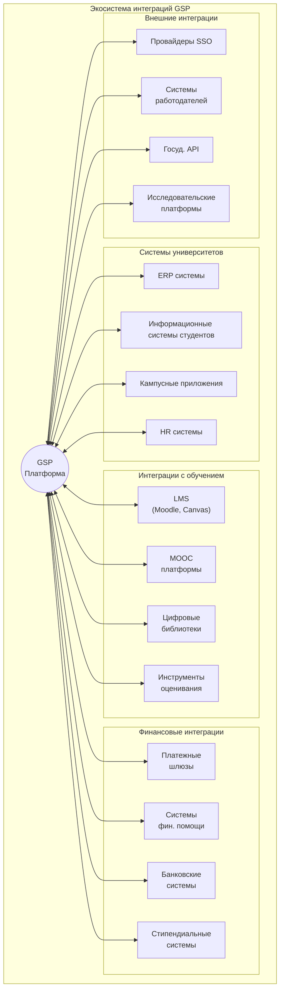

### Модели интеграции

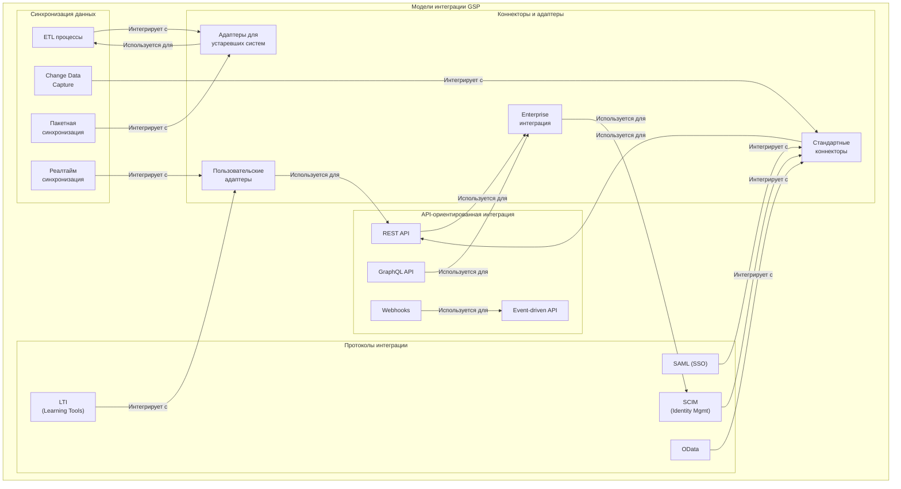

## Диаграмма управления данными

### Стратегия управления данными

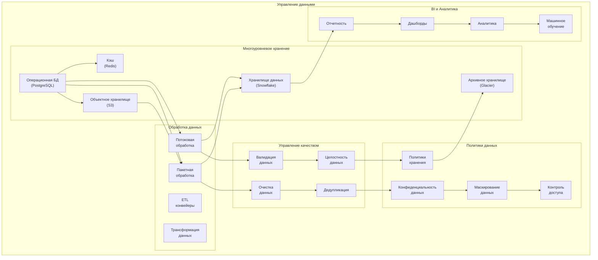

### Архитектура данных по категориям

```mermaid
graph TD
    subgraph "Архитектура данных GSP"
        subgraph "Данные студентов"
            PersonalInfo["Личная информация"]
            AcademicRecords["Академические записи"]
            FinancialData["Финансовая информация"]
            BehavioralData["Поведенческие данные"]
        end

        subgraph "Академические данные"
            Curriculum["Учебный план"]
            CourseContent["Контент курсов"]
            AssessmentData["Данные оценивания"]
            ProgramStructure["Структура программ"]
        end

        subgraph "Институциональные данные"
            TenantConfig["Настройки учреждения"]
            DepartmentInfo["Информация отделений"]
            StaffData["Данные персонала"]
            FacilityInfo["Информация об объектах"]
        end

        subgraph "Транзакционные данные"
            EnrollmentTxn["Регистрационные транзакции"]
            FinancialTxn["Финансовые транзакции"]
            SystemUsage["Использование системы"]
            AuditRecords["Записи аудита"]
        end
    end

    subgraph "Стратегии обработки по типам данных"
        subgraph "Стратегия для чувствительных данных"
            Encryption["Шифрование"]
            StrictAccess["Строгий контроль доступа"]
            AuditTrail["Полный аудит"]
            MinimalRetention["Минимальное хранение"]
        end

        subgraph "Стратегия для транзакционных данных"
            HighPerformance["Высокая производительность"]
            Scalability["Масштабируемость"]
            ACID["ACID свойства"]
            BackupRecovery["Резервное копирование"]
        end

        subgraph "Стратегия для контента"
            Versioning["Версионность"]
            CDNDistribution["Распространение через CDN"]
            MetadataIndexing["Индексация метаданных"]
            ContentSearching["Поиск по контенту"]
        end

        subgraph "Стратегия для аналитики"
            Aggregation["Агрегация"]
            HistoricalStorage["Историческое хранение"]
            Anonymization["Анонимизация"]
            BigDataProcessing["Обработка больших данных"]
        end
    end

    PersonalInfo --> Encryption
    AcademicRecords --> StrictAccess
    FinancialData --> AuditTrail
    BehavioralData --> MinimalRetention

    EnrollmentTxn --> HighPerformance
    FinancialTxn --> ACID
    SystemUsage --> Scalability
    AuditRecords --> BackupRecovery

    Curriculum --> Versioning
    CourseContent --> CDNDistribution
    AssessmentData --> MetadataIndexing
    ProgramStructure --> ContentSearching

    AcademicRecords --> Aggregation
    SystemUsage --> HistoricalStorage
    BehavioralData --> Anonymization
    EnrollmentTxn --> BigDataProcessing
```

## Диаграмма производительности

### Стратегия оптимизации производительности

```mermaid
flowchart TD
    subgraph "Оптимизация производительности"
        subgraph "Клиентская производительность"
            ResourceMinification["Минификация ресурсов"]
            LazyLoading["Ленивая загрузка"]
            ImageOptimization["Оптимизация изображений"]
            CSSOptimization["Оптимизация CSS"]
            JavascriptOptimization["Оптимизация Javascript"]
        end

        subgraph "Сетевая производительность"
            HTTPCaching["HTTP кэширование"]
            CompressionGzip["Gzip/Brotli сжатие"]
            CachingHeaders["Заголовки кэширования"]
            KeepAlive["Keep-alive соединения"]
            HTTP2["HTTP/2 поддержка"]
        end

        subgraph "Серверная производительность"
            ConnectionPooling["Пулы соединений"]
            AsyncProcessing["Асинхронная обработка"]
            Caching["Кэширование"]
            DBOptimization["Оптимизация БД"]
            QueryOptimization["Оптимизация запросов"]
        end

        subgraph "Мониторинг и оценка"
            RealUserMonitoring["Мониторинг реальных пользователей"]
            SyntheticMonitoring["Синтетический мониторинг"]
            APM["Мониторинг производительности приложений"]
            LoadTesting["Нагрузочное тестирование"]
            Benchmarking["Бенчмаркинг"]
        end
    end

    ResourceMinification --> LazyLoading
    LazyLoading --> ImageOptimization
    ImageOptimization --> CSSOptimization
    CSSOptimization --> JavascriptOptimization

    JavascriptOptimization --> HTTPCaching
    HTTPCaching --> CompressionGzip
    CompressionGzip --> CachingHeaders
    CachingHeaders --> KeepAlive
    KeepAlive --> HTTP2

    HTTP2 --> ConnectionPooling
    ConnectionPooling --> AsyncProcessing
    AsyncProcessing --> Caching
    Caching --> DBOptimization
    DBOptimization --> QueryOptimization

    QueryOptimization --> RealUserMonitoring
    RealUserMonitoring --> SyntheticMonitoring
    SyntheticMonitoring --> APM
    APM --> LoadTesting
    LoadTesting --> Benchmarking
```

### Метрики производительности

```mermaid
graph TD
    subgraph "Ключевые метрики производительности"
        subgraph "Метрики восприятия пользователем"
            TTFB["Time to First Byte"]
            FCP["First Contentful Paint"]
            LCP["Largest Contentful Paint"]
            TTI["Time to Interactive"]
            FID["First Input Delay"]
            CLS["Cumulative Layout Shift"]
        end

        subgraph "Серверные метрики"
            ResponseTime["Время отклика"]
            ThroughputRPS["Пропускная способность\n(запросов в секунду)"]
            ErrorRate["Частота ошибок"]
            CPUUtilization["Утилизация CPU"]
            MemoryUsage["Использование памяти"]
            DBResponseTime["Время отклика БД"]
        end

        subgraph "Бизнес-метрики"
            SessionDuration["Длительность сессии"]
            Conversion["Конверсия"]
            Abandonment["Отказ"]
            UserSatisfaction["Удовлетворенность пользователей"]
            ReturnRate["Частота возврата"]
        end

        subgraph "Инфраструктурные метрики"
            LoadAverage["Средняя нагрузка"]
            NetworkLatency["Сетевая задержка"]
            DiskIO["Дисковый ввод-вывод"]
            ConnectionsCount["Количество соединений"]
            QueueDepth["Глубина очередей"]
        end
    end

    TTFB --> FCP
    FCP --> LCP
    LCP --> TTI
    TTI --> FID
    FID --> CLS

    CLS --> ResponseTime
    ResponseTime --> ThroughputRPS
    ThroughputRPS --> ErrorRate
    ErrorRate --> CPUUtilization
    CPUUtilization --> MemoryUsage
    MemoryUsage --> DBResponseTime

    DBResponseTime --> SessionDuration
    SessionDuration --> Conversion
    Conversion --> Abandonment
    Abandonment --> UserSatisfaction
    UserSatisfaction --> ReturnRate

    ReturnRate --> LoadAverage
    LoadAverage --> NetworkLatency
    NetworkLatency --> DiskIO
    DiskIO --> ConnectionsCount
    ConnectionsCount --> QueueDepth
```

## Метрики системы и прогнозируемая нагрузка

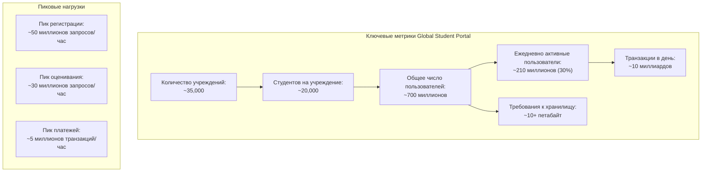

| Метрика                               | Значение                 | Примечания                                                   |
| ------------------------------------- | ------------------------ | ------------------------------------------------------------ |
| Количество учреждений                 | ~35,000                  | Разнообразие от небольших колледжей до крупных университетов |
| Студентов в каждом учреждении         | ~20,000                  | В среднем, варьируется от 1,000 до 100,000+                  |
| Общее количество пользователей        | ~700 миллионов           | Включая студентов, преподавателей, администраторов           |
| Ежедневно активные пользователи (DAU) | ~210 миллионов (30%)     | Может увеличиваться в период экзаменов                       |
| Хранение данных пользователя          | ~15 ГБ на 1000 студентов | Включая документы, задания, тесты                            |
| Общие требования к хранилищу          | >10 петабайт             | С учетом роста и резервного копирования                      |

### Влияние на архитектуру

Эти метрики подтверждают необходимость:

- Глобально распределенной архитектуры с несколькими дата-центрами
- Шардинга данных по географическому принципу
- Aggressive caching на всех уровнях
- Асинхронной обработки для неинтерактивных задач
- Автоматического масштабирования инфраструктуры
