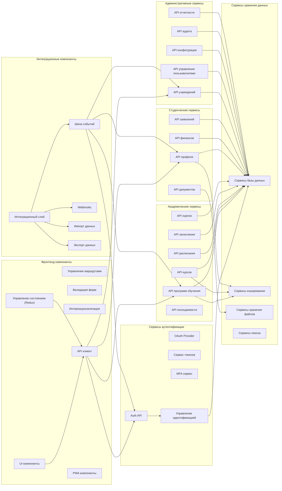
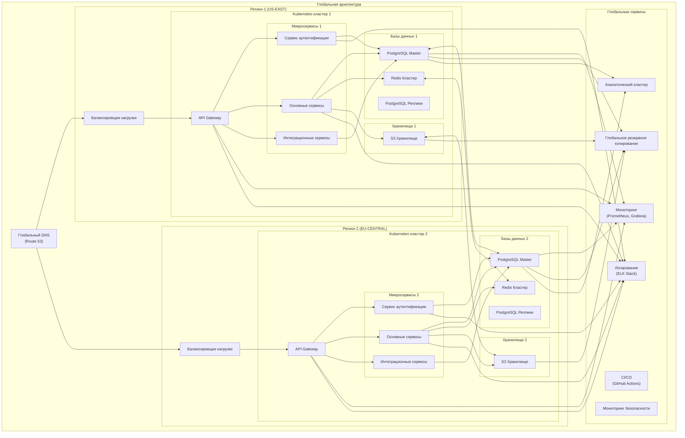
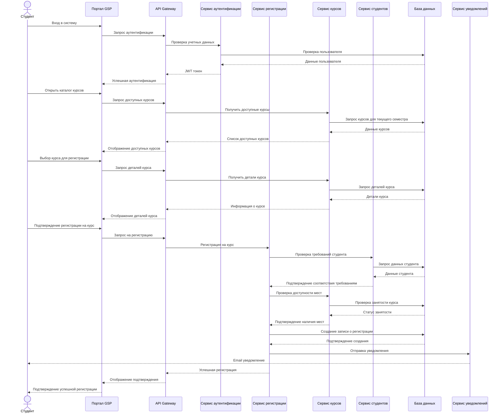
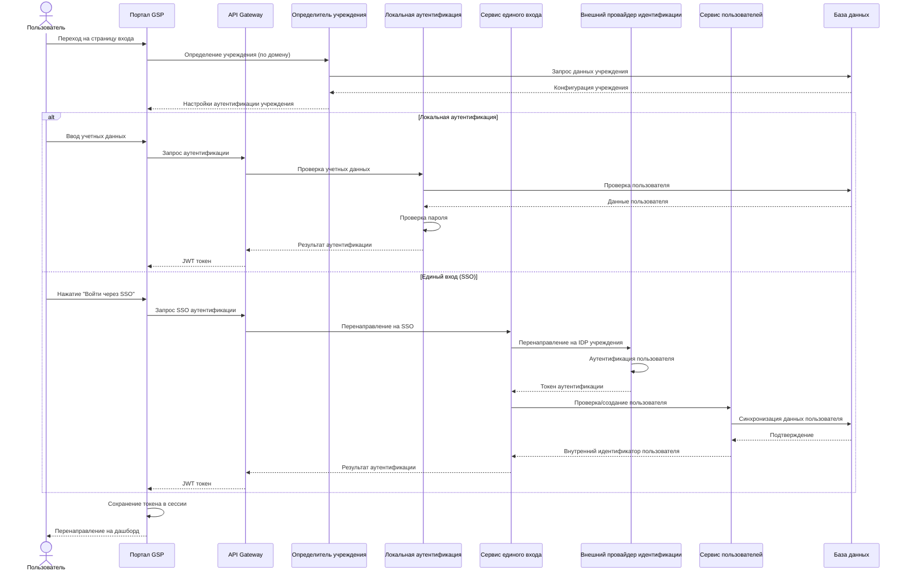

# Профессиональные диаграммы для Глобального Студенческого Портала (GSP)

## Содержание

1. [Архитектурная диаграмма системы](#архитектурная-диаграмма-системы)
2. [Диаграмма компонентов](#диаграмма-компонентов)
3. [Диаграмма развертывания](#диаграмма-развертывания)
4. [Диаграмма потока данных](#диаграмма-потока-данных)
5. [ER-диаграмма базы данных](#er-диаграмма-базы-данных)
6. [Диаграмма сценариев использования](#диаграмма-сценариев-использования)
7. [Диаграмма последовательности](#диаграмма-последовательности)

## Архитектурная диаграмма системы

```mermaid
flowchart TB
    subgraph "Клиентский уровень"
        WebApp["Веб-приложение (React)"]
        MobileApp["Мобильное приложение (React Native)"]
        ThirdParty["Интеграции третьих сторон (API)"]
    end

    subgraph "Уровень API Gateway"
        APIGateway["API Gateway"]
        APIGateway --- Auth["Аутентификация"]
        APIGateway --- RateLimit["Ограничение запросов"]
        APIGateway --- Routing["Маршрутизация"]
        APIGateway --- Logging["Логирование"]
    end

    subgraph "Сервисный уровень"
        AuthService["Сервис аутентификации"]
        CoreAPIs["Основные API"]
        IntegrationServices["Интеграционные сервисы"]
    end

    subgraph "Уровень микросервисов"
        subgraph "Академические сервисы"
            AcademicManagement["Управление академическими программами"]
            CourseManagement["Управление курсами"]
            Grading["Система оценок"]
            Scheduling["Расписание"]
        end

        subgraph "Административные сервисы"
            AdminPanel["Административная панель"]
            ReportingAnalytics["Отчетность и аналитика"]
            TenantManagement["Управление учреждениями"]
        end

        subgraph "Студенческие сервисы"
            StudentProfile["Профиль студента"]
            Enrollment["Зачисление"]
            Attendance["Посещаемость"]
            FinancialAid["Финансовая помощь"]
        end

        subgraph "Вспомогательные сервисы"
            Communication["Коммуникации"]
            Library["Библиотека"]
            ExchangeProgram["Программы обмена"]
            EventManagement["Управление мероприятиями"]
        end
    end

    subgraph "Уровень данных"
        subgraph "Реляционные БД"
            PostgreSQL["PostgreSQL (Мульти-тенантная)"]
            ReadReplicas["Реплики для чтения"]
        end

        subgraph "Кэширование"
            Redis["Redis кластер"]
        end

        subgraph "Файловое хранилище"
            S3["Объектное хранилище (S3)"]
        end

        subgraph "Аналитика"
            DataWarehouse["Хранилище данных"]
            ElasticSearch["ElasticSearch"]
        end
    end

    subgraph "Общие компоненты"
        Security["Безопасность"]
        Monitoring["Мониторинг"]
        Logging2["Логирование"]
        i18n["Интернационализация"]
    end

    WebApp --> APIGateway
    MobileApp --> APIGateway
    ThirdParty --> APIGateway

    APIGateway --> AuthService
    APIGateway --> CoreAPIs
    APIGateway --> IntegrationServices

    AuthService --> Security
    CoreAPIs --> AcademicManagement
    CoreAPIs --> StudentProfile
    CoreAPIs --> AdminPanel
    CoreAPIs --> Communication

    AcademicManagement --> PostgreSQL
    CourseManagement --> PostgreSQL
    Grading --> PostgreSQL
    AdminPanel --> PostgreSQL
    StudentProfile --> PostgreSQL
    Enrollment --> PostgreSQL
    Library --> S3
    Communication --> Redis

    PostgreSQL <--> ReadReplicas
    AcademicManagement --> Redis
    ReportingAnalytics --> DataWarehouse
    ReportingAnalytics --> ElasticSearch

    Logging --> Monitoring
    Logging2 --> Monitoring
```



## Диаграмма компонентов



## Диаграмма развертывания



## Диаграмма потока данных

```mermaid
flowchart TD
    Student["Студент"]
    Faculty["Преподаватель"]
    Admin["Администратор"]
    ExternalSystem["Внешняя система"]

    subgraph "Аутентификация"
        Login["Процесс входа"]
        SSO["Единый вход (SSO)"]
        Auth["Аутентификация и авторизация"]
    end

    subgraph "Студенческий портал"
        ViewProfile["Просмотр профиля"]
        RegisterCourses["Регистрация на курсы"]
        ViewGrades["Просмотр оценок"]
        SubmitAssignments["Отправка заданий"]
        PayFees["Оплата обучения"]
        RequestDocuments["Запрос документов"]
    end

    subgraph "Преподавательский портал"
        ManageCourses["Управление курсами"]
        GradeAssignments["Оценка заданий"]
        TrackAttendance["Отслеживание посещаемости"]
        CommunicateStudents["Коммуникация со студентами"]
    end

    subgraph "Административный портал"
        ManageTenants["Управление учреждениями"]
        ConfigureSystem["Настройка системы"]
        MonitorUsage["Мониторинг использования"]
        GenerateReports["Создание отчетов"]
        ManageUsers["Управление пользователями"]
    end

    subgraph "Хранилища данных"
        UserDB["База данных пользователей"]
        AcademicDB["Академическая база данных"]
        FinancialDB["Финансовая база данных"]
        ContentStorage["Хранилище контента"]
        ConfigDB["База данных настроек"]
        AuditLog["Журнал аудита"]
    end

    Student --> Login
    Faculty --> Login
    Admin --> Login
    ExternalSystem --> SSO

    Login --> Auth
    SSO --> Auth
    Auth --> UserDB

    Student --> ViewProfile
    ViewProfile --> UserDB

    Student --> RegisterCourses
    RegisterCourses --> AcademicDB

    Student --> ViewGrades
    ViewGrades --> AcademicDB

    Student --> SubmitAssignments
    SubmitAssignments --> ContentStorage
    SubmitAssignments --> AcademicDB

    Student --> PayFees
    PayFees --> FinancialDB

    Student --> RequestDocuments
    RequestDocuments --> AcademicDB
    RequestDocuments --> ContentStorage

    Faculty --> ManageCourses
    ManageCourses --> AcademicDB
    ManageCourses --> ContentStorage

    Faculty --> GradeAssignments
    GradeAssignments --> AcademicDB
    GradeAssignments --> ContentStorage

    Faculty --> TrackAttendance
    TrackAttendance --> AcademicDB

    Faculty --> CommunicateStudents
    CommunicateStudents --> UserDB

    Admin --> ManageTenants
    ManageTenants --> ConfigDB

    Admin --> ConfigureSystem
    ConfigureSystem --> ConfigDB

    Admin --> MonitorUsage
    MonitorUsage --> AuditLog

    Admin --> GenerateReports
    GenerateReports --> AcademicDB
    GenerateReports --> FinancialDB
    GenerateReports --> UserDB

    Admin --> ManageUsers
    ManageUsers --> UserDB

    AcademicDB --> AuditLog
    FinancialDB --> AuditLog
    UserDB --> AuditLog
    ConfigDB --> AuditLog
```



## ER-диаграмма базы данных

```mermaid
erDiagram
    TENANT {
        int tenant_id PK
        string name
        string domain
        string logo_url
        string contact_email
        string subscription_tier
        bool active_status
        datetime created_at
        datetime updated_at
        json settings
        json theme_config
    }

    USER {
        int user_id PK
        int tenant_id FK
        string username
        string email
        string password_hash
        string first_name
        string last_name
        string role
        datetime last_login
        datetime created_at
        datetime updated_at
    }

    STUDENT {
        int student_id PK
        int user_id FK
        string enrollment_status
        date admission_date
        date expected_grad_date
        float current_gpa
        string academic_standing
        int program_id FK
        int advisor_id FK
        datetime created_at
        datetime updated_at
    }

    FACULTY {
        int faculty_id PK
        int user_id FK
        int department_id FK
        string title
        date hire_date
        string expertise
        string tenure_status
        datetime created_at
        datetime updated_at
    }

    ADMIN_STAFF {
        int staff_id PK
        int user_id FK
        int department_id FK
        string title
        json permissions
        date hire_date
        datetime created_at
        datetime updated_at
    }

    PROGRAM {
        int program_id PK
        int tenant_id FK
        string name
        string description
        string degree_level
        int credits_required
        int department_id FK
        bool active_status
        datetime created_at
        datetime updated_at
    }

    COURSE {
        int course_id PK
        int tenant_id FK
        int program_id FK
        string code
        string title
        string description
        int credits
        json prerequisites
        datetime created_at
        datetime updated_at
    }

    CLASS {
        int class_id PK
        int course_id FK
        int term_id FK
        string section_number
        int faculty_id FK
        int room_id FK
        json schedule
        int enrollment_cap
        int enrollment_count
        string status
        datetime created_at
        datetime updated_at
    }

    ENROLLMENT {
        int enrollment_id PK
        int student_id FK
        int class_id FK
        date enrollment_date
        string grade
        json attendance_record
        string status
        datetime created_at
        datetime updated_at
    }

    TERM_CALENDAR {
        int term_id PK
        int tenant_id FK
        string name
        date start_date
        date end_date
        date registration_start
        date registration_end
        date final_exam_week
        datetime created_at
        datetime updated_at
    }

    ASSIGNMENT {
        int assignment_id PK
        int class_id FK
        string title
        string description
        datetime due_date
        float max_points
        float weight
        datetime created_at
        datetime updated_at
    }

    SUBMISSION {
        int submission_id PK
        int assignment_id FK
        int student_id FK
        datetime submit_date
        json file_urls
        string comments
        float grade
        string feedback
        datetime created_at
        datetime updated_at
    }

    FINANCIAL_ACCOUNT {
        int account_id PK
        int student_id FK
        float balance
        string currency
        string credit_status
        date last_payment_date
        datetime created_at
        datetime updated_at
    }

    TRANSACTION {
        int transaction_id PK
        int account_id FK
        float amount
        string type
        string description
        string status
        string payment_method
        datetime created_at
        datetime updated_at
    }

    TENANT ||--o{ USER : "contains"
    USER ||--o| STUDENT : "is"
    USER ||--o| FACULTY : "is"
    USER ||--o| ADMIN_STAFF : "is"
    TENANT ||--o{ PROGRAM : "offers"
    PROGRAM ||--o{ COURSE : "contains"
    COURSE ||--o{ CLASS : "has"
    TERM_CALENDAR ||--o{ CLASS : "schedules"
    CLASS ||--o{ ENROLLMENT : "has"
    STUDENT ||--o{ ENROLLMENT : "has"
    STUDENT ||--o| FINANCIAL_ACCOUNT : "has"
    FINANCIAL_ACCOUNT ||--o{ TRANSACTION : "records"
    CLASS ||--o{ ASSIGNMENT : "contains"
    ASSIGNMENT ||--o{ SUBMISSION : "receives"
    STUDENT ||--o{ SUBMISSION : "makes"
    TENANT ||--o{ TERM_CALENDAR : "establishes"
```

## Диаграмма сценариев использования

```mermaid
flowchart TD
    Student((Студент))
    Faculty((Преподаватель))
    Administrator((Администратор))
    SystemAdmin((Системный администратор))
    ExternalSystem((Внешняя система))

    subgraph "Управление аккаунтом"
        Login[Вход в систему]
        Register[Регистрация]
        ResetPassword[Сброс пароля]
        EditProfile[Редактирование профиля]
        ManageSettings[Управление настройками]
    end

    subgraph "Академические функции студента"
        ViewCourses[Просмотр курсов]
        RegisterCourse[Регистрация на курс]
        DropCourse[Отказ от курса]
        ViewSchedule[Просмотр расписания]
        ViewGrades[Просмотр оценок]
        ViewTranscript[Просмотр академической справки]
        SubmitAssignment[Отправка задания]
        TakeQuiz[Прохождение теста]
        RequestDocument[Запрос документа]
        ApplyForGraduation[Подача на выпуск]
    end

    subgraph "Финансы студента"
        ViewBill[Просмотр счета]
        MakePayment[Совершение оплаты]
        ApplyScholarship[Подача на стипендию]
        ViewFinancialAid[Просмотр финансовой помощи]
        SetupPaymentPlan[Настройка плана оплаты]
    end

    subgraph "Функции преподавателя"
        ManageCourse[Управление курсом]
        CreateAssignment[Создание задания]
        GradeWork[Оценивание работы]
        TrackAttendance[Отслеживание посещаемости]
        CommunicateWithStudents[Общение со студентами]
        CreateExams[Создание экзаменов]
        ViewReports[Просмотр отчетов]
    end

    subgraph "Административные функции"
        ManageUsers[Управление пользователями]
        ManageCourses[Управление курсами]
        ManagePrograms[Управление программами]
        GenerateReports[Создание отчетов]
        ManageCalendar[Управление календарем]
        AssignFaculty[Назначение преподавателей]
        ApproveRequests[Одобрение запросов]
    end

    subgraph "Функции системного администратора"
        ConfigureTenant[Настройка учреждения]
        ManageIntegrations[Управление интеграциями]
        MonitorPerformance[Мониторинг производительности]
        ManageSecuritySettings[Управление настройками безопасности]
        SystemBackup[Резервное копирование]
        AuditSystem[Аудит системы]
    end

    subgraph "Интеграции"
        SyncData[Синхронизация данных]
        ExportData[Экспорт данных]
        ImportData[Импорт данных]
        AuthenticateExternal[Внешняя аутентификация]
    end

    Student --> Login
    Student --> Register
    Student --> ResetPassword
    Student --> EditProfile
    Student --> ManageSettings
    Student --> ViewCourses
    Student --> RegisterCourse
    Student --> DropCourse
    Student --> ViewSchedule
    Student --> ViewGrades
    Student --> ViewTranscript
    Student --> SubmitAssignment
    Student --> TakeQuiz
    Student --> RequestDocument
    Student --> ApplyForGraduation
    Student --> ViewBill
    Student --> MakePayment
    Student --> ApplyScholarship
    Student --> ViewFinancialAid
    Student --> SetupPaymentPlan

    Faculty --> Login
    Faculty --> ResetPassword
    Faculty --> EditProfile
    Faculty --> ManageSettings
    Faculty --> ManageCourse
    Faculty --> CreateAssignment
    Faculty --> GradeWork
    Faculty --> TrackAttendance
    Faculty --> CommunicateWithStudents
    Faculty --> CreateExams
    Faculty --> ViewReports

    Administrator --> Login
    Administrator --> ResetPassword
    Administrator --> EditProfile
    Administrator --> ManageUsers
    Administrator --> ManageCourses
    Administrator --> ManagePrograms
    Administrator --> GenerateReports
    Administrator --> ManageCalendar
    Administrator --> AssignFaculty
    Administrator --> ApproveRequests

    SystemAdmin --> Login
    SystemAdmin --> ResetPassword
    SystemAdmin --> ConfigureTenant
    SystemAdmin --> ManageIntegrations
    SystemAdmin --> MonitorPerformance
    SystemAdmin --> ManageSecuritySettings
    SystemAdmin --> SystemBackup
    SystemAdmin --> AuditSystem

    ExternalSystem --> SyncData
    ExternalSystem --> ExportData
    ExternalSystem --> ImportData
    ExternalSystem --> AuthenticateExternal
```



## Диаграмма последовательности

### Сценарий регистрации студента на курс



### Сценарий аутентификации с разными типами учреждений


