# Диаграммы пользовательского интерфейса - Глобальный Студенческий Портал (GSP)

## Содержание

1. [Структура пользовательского интерфейса](#структура-пользовательского-интерфейса)
2. [Макеты основных экранов](#макеты-основных-экранов)
3. [Пользовательские потоки](#пользовательские-потоки)
4. [Адаптивный дизайн](#адаптивный-дизайн)
5. [Тематизация по университетам](#тематизация-по-университетам)

## Структура пользовательского интерфейса

### Общая структура портала

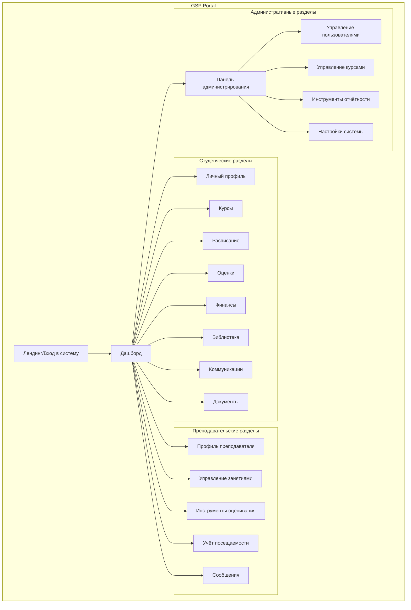

### Компоненты основного интерфейса

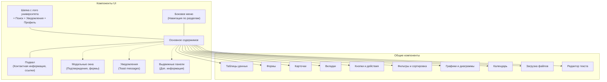

## Макеты основных экранов

### Страница входа в систему

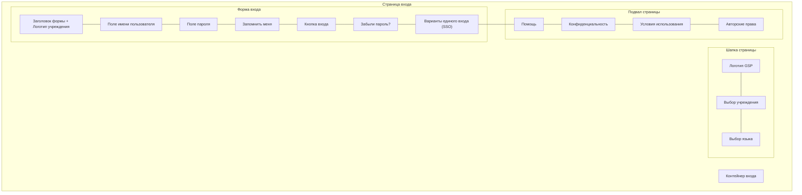

### Дашборд студента

```mermaid
graph TD
    subgraph "Дашборд студента"
        HeaderBar["Шапка с навигацией"]

        subgraph "Боковое меню"
            MenuProfile["Профиль"]
            MenuCourses["Курсы"]
            MenuSchedule["Расписание"]
            MenuGrades["Оценки"]
            MenuLibrary["Библиотека"]
            MenuFinances["Финансы"]
            MenuCommunication["Коммуникации"]
            MenuDocuments["Документы"]
            MenuSettings["Настройки"]
        end

        subgraph "Основное содержимое"
            WelcomeCard["Приветственная карточка"]

            subgraph "Верхний ряд виджетов"
                UpcomingEvents["Предстоящие события"]
                Notifications["Уведомления"]
                QuickActions["Быстрые действия"]
            end

            subgraph "Средний ряд виджетов"
                CurrentCourses["Текущие курсы"]
                Assignments["Задания"]
                GradeOverview["Обзор оценок"]
            end

            subgraph "Нижний ряд виджетов"
                FinancialSummary["Финансовая сводка"]
                AnnouncementsWidget["Объявления"]
                UsefulLinks["Полезные ссылки"]
            end
        end

        FooterBar["Подвал страницы"]
    end

    HeaderBar --- MenuProfile
    MenuProfile --- MenuCourses
    MenuCourses --- MenuSchedule
    MenuSchedule --- MenuGrades
    MenuGrades --- MenuLibrary
    MenuLibrary --- MenuFinances
    MenuFinances --- MenuCommunication
    MenuCommunication --- MenuDocuments
    MenuDocuments --- MenuSettings

    HeaderBar --- WelcomeCard
    WelcomeCard --- UpcomingEvents
    UpcomingEvents --- Notifications
    Notifications --- QuickActions

    QuickActions --- CurrentCourses
    CurrentCourses --- Assignments
    Assignments --- GradeOverview

    GradeOverview --- FinancialSummary
    FinancialSummary --- AnnouncementsWidget
    AnnouncementsWidget --- UsefulLinks

    UsefulLinks --- FooterBar
```

### Страница курса

```mermaid
graph TD
    subgraph "Страница курса"
        CourseHeader["Заголовок курса + Код + Преподаватель"]

        subgraph "Навигация по курсу"
            TabOverview["Обзор"]
            TabSyllabus["Программа"]
            TabMaterials["Материалы"]
            TabAssignments["Задания"]
            TabDiscussions["Обсуждения"]
            TabGrades["Оценки"]
            TabAttendance["Посещаемость"]
        end

        subgraph "Обзор курса"
            CourseInfo["Информация о курсе"]
            InstructorInfo["Информация о преподавателе"]
            UpcomingDeadlines["Предстоящие сроки"]
            RecentAnnouncements["Последние объявления"]
            ProgressBar["Прогресс по курсу"]
        end

        subgraph "Секция материалов"
            WeeklyModules["Модули по неделям"]

            subgraph "Модуль недели"
                ModuleTitle["Заголовок модуля"]
                LectureNotes["Конспекты лекций"]
                ReadingMaterials["Материалы для чтения"]
                PracticalMaterials["Практические материалы"]
                ModuleAssignments["Задания модуля"]
            end
        end
    end

    CourseHeader --- TabOverview
    TabOverview --- TabSyllabus
    TabSyllabus --- TabMaterials
    TabMaterials --- TabAssignments
    TabAssignments --- TabDiscussions
    TabDiscussions --- TabGrades
    TabGrades --- TabAttendance

    TabOverview --- CourseInfo
    CourseInfo --- InstructorInfo
    InstructorInfo --- UpcomingDeadlines
    UpcomingDeadlines --- RecentAnnouncements
    RecentAnnouncements --- ProgressBar

    TabMaterials --- WeeklyModules
    WeeklyModules --- ModuleTitle
    ModuleTitle --- LectureNotes
    LectureNotes --- ReadingMaterials
    ReadingMaterials --- PracticalMaterials
    PracticalMaterials --- ModuleAssignments
```

## Пользовательские потоки

### Регистрация на курс

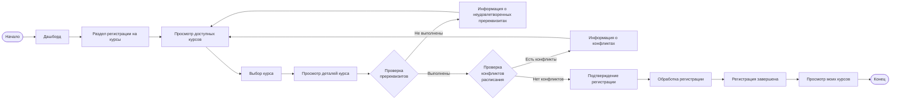

### Подача и оценка задания

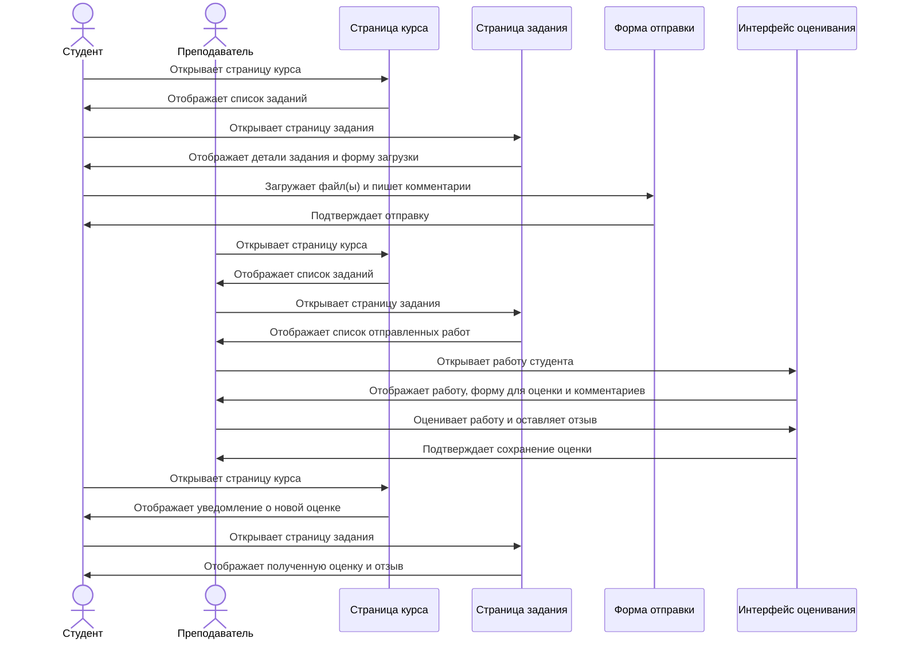

## Адаптивный дизайн

### Структура адаптивного интерфейса

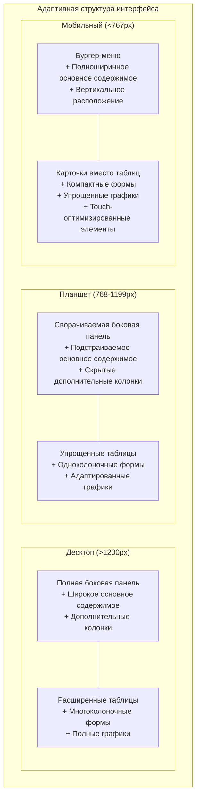

### Пример адаптивной страницы курса

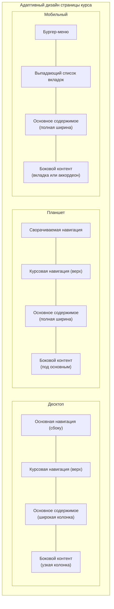

## Тематизация по университетам

### Система тематизации

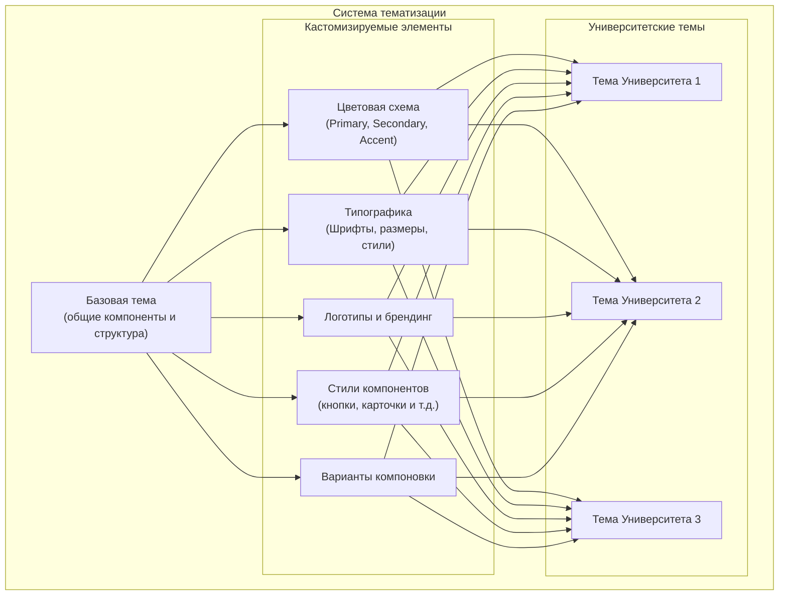

### Пример тематизации по университетам

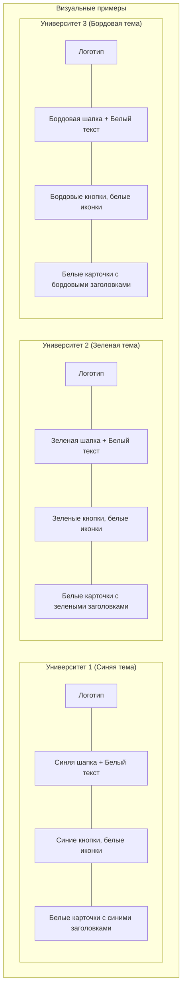
